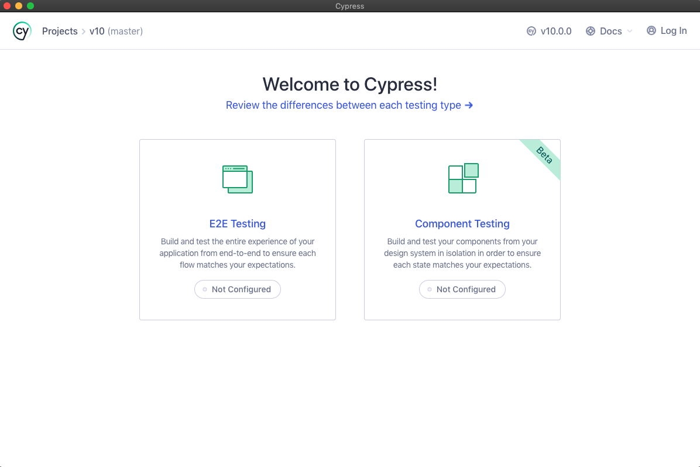
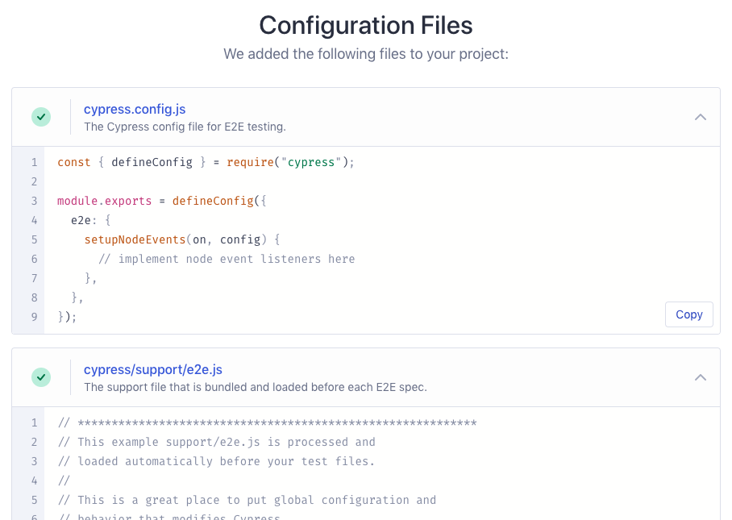

# 🥳 3. Test Runner

Cypress projemizi çalıştırmak için bir App indirmemiz gerekiyor.

Link: [https://download.cypress.io/desktop](https://download.cypress.io/desktop)


### Hadi başlayalım

Oluşturduğumuz proje dizinine gelip&#x20;

```bash
// npx kullanarak 
npx cypress open

// yarn kullanarak
yarn run cypress open

// path vererek
./node_modules/.bin/cypress open
```

Bir süre sonra Cypress Launchpad açılacaktır.


### **npm Komut Dosyaları Ekleme**

Her seferinde Cypress çalıştırılabilir dosyasının tam yolunu yazmanın yanlış bir tarafı olmasa da, Cypress komutlarını package.json dosyanızdaki betikler alanına eklemek çok daha kolay ve anlaşılırdır.

```json
{
  "scripts": {
    "cypress:open": "cypress open"
  }
}
```


## Launchpad

<figure><figcaption><p>Cypress Launchpad Arayüzü</p></figcaption></figure>

E2E yazmak için terchimiz **sol tarafta** bulunanan kısmı seçiyoruz. İlk defa yapacağımız için bizim için konfigüre dosyalarını projemize ekleyecektir.

<figure><figcaption><p>konfigüre dosyaları</p></figcaption></figure>
